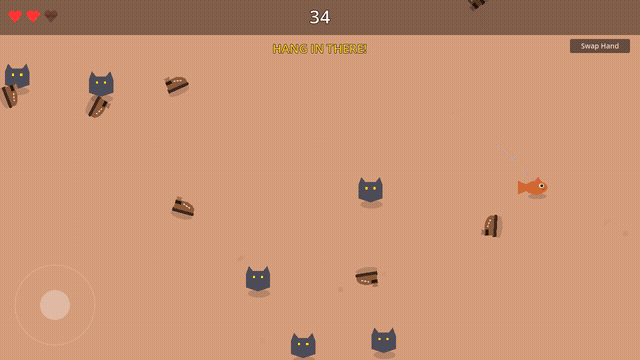
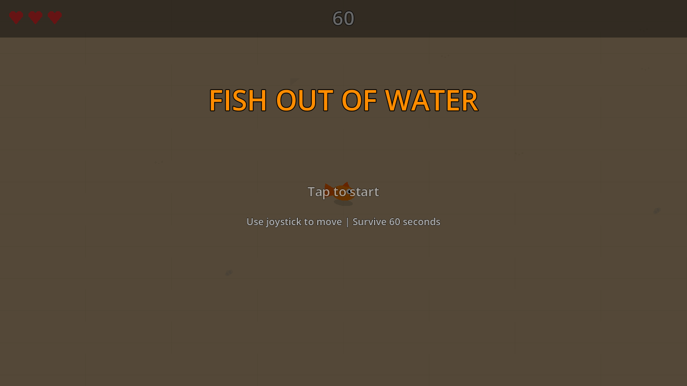
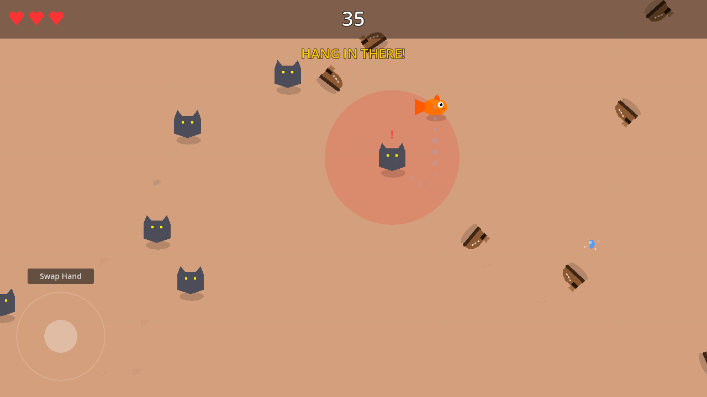

# Fish Out of Water

> **AI Generated Slop** — This entire game (code, visuals, game design) was generated by AI. No humans were harmed in the making of this fish.

A 60-second survival game where you play as a fish that jumped out of its bowl. Dodge cats, shoes, furniture, and roombas until the kid gets home from school to scoop you back in.

**[Play it now](https://vppillai.github.io/godot_slop/)**



## Screenshots

| Title Screen | Gameplay |
|:---:|:---:|
|  |  |

## How to Play

- **Desktop:** WASD or Arrow keys to move. Press any key to start.
- **Mobile:** Touch joystick (bottom-left). Tap to start. "Swap Hand" button moves the joystick to the other side.
- **Goal:** Survive 60 seconds. Collect water droplets to heal and puddles for a speed boost.

## Hazard Timeline

| Time | Hazard | Description |
|------|--------|-------------|
| 0s | Cats | Wander and lunge when close |
| 15s | Shoes | Thrown projectiles that tumble across the screen |
| 30s | Furniture | Sliding couches from the edges |
| 45s | Roomba | Relentlessly chases you |
| 50s | 2nd Roomba | They have friends |
| 55s | Cat Frenzy | 5 cats at once + 3rd roomba |

## Tech

- **Engine:** Godot 4.6
- **Graphics:** 100% procedural — all visuals drawn in `_draw()` with no texture assets
- **Platform:** Web (HTML5/WebAssembly), works on desktop and mobile browsers
- **Source:** GDScript, ~1000 lines across 15 scripts

## Building

Requires [Godot 4.6+](https://godotengine.org/download).

```bash
# Run locally
/path/to/godot --path . --windowed

# Export for web
/path/to/godot --headless --export-release "Web" build/web/index.html
```

## License

Do whatever you want with it. It's slop.
